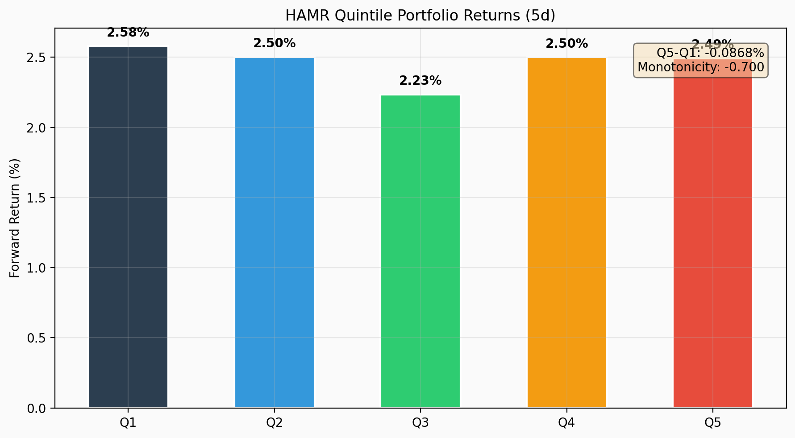
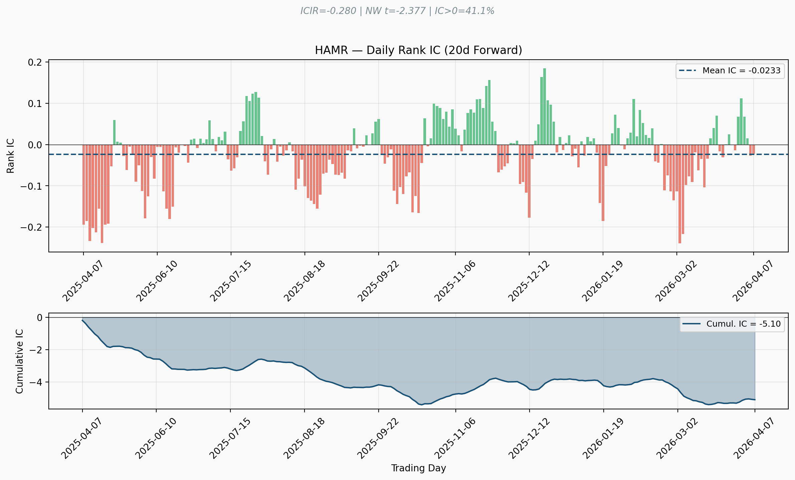
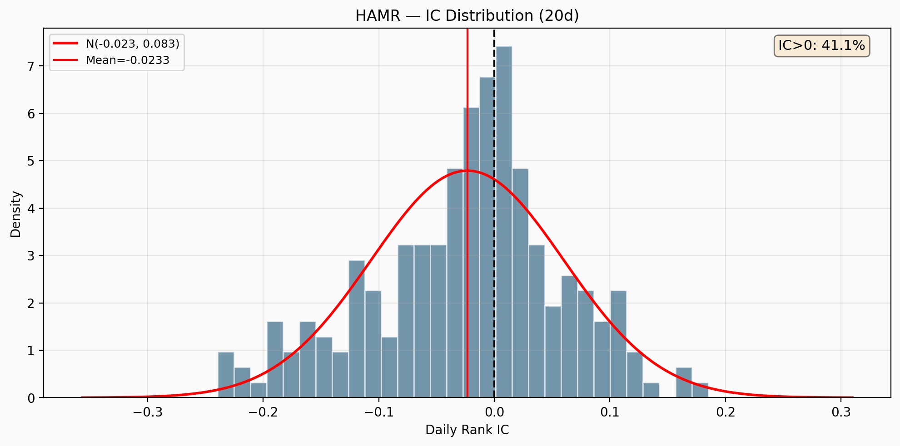
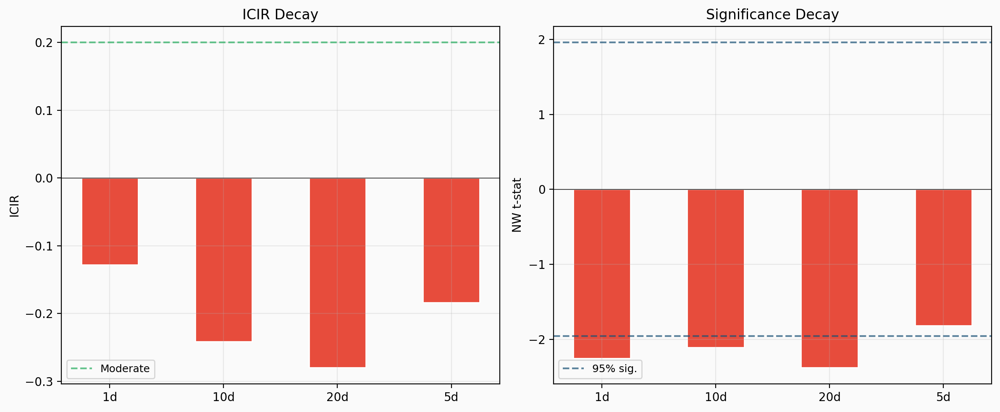
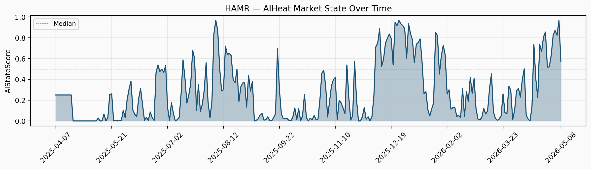

<p align="center">
  
</p>

# HAMR Factor — HAMR Mispricing Reversion Research

> **《AI 同质化交易错杀修复》因子 — 学术验证与复现**

<p align="center">
  <b>HAMR v1.0 Demo — Research Prototype</b><br>
  <em>Not production-ready. See <a href="docs/LIMITATIONS.md">LIMITATIONS.md</a></em>
</p>

---
  <a href="#-abstract"><strong>Abstract</strong></a> ·
  <a href="#-theory"><strong>Theory</strong></a> ·
  <a href="#-factor-construction"><strong>Factor</strong></a> ·
  <a href="#-empirical-results"><strong>Results</strong></a> ·
  <a href="#-usage"><strong>Usage</strong></a> ·
  <a href="#-architecture"><strong>Architecture</strong></a>
</p>

---

## 🧠 Intuition

When AI quant tools and templated strategies become widespread, capital
concentrates in stocks that fit the "hot template" — high momentum, high
turnover, attention-grabbing names.

Meanwhile, fundamentally sound stocks that don't match current templates
may be neglected or passively sold, creating **short-term mispricing**.

The HAMR factor identifies these stocks *before* the market corrects:

> **High-quality + non-template + residual weakness + no crowding
> → potential mispricing reversal**

---

## 📜 Abstract

We introduce the **HAMR (Homogeneous AI Mispricing Reversion)** factor —
a conditional, mean-reverting, quality-constrained Alpha for Chinese
A-shares.

Unlike simple reversal or low-crowding factors, HAMR requires
**simultaneous satisfaction** of five conditions:

| Condition | What it means |
|-----------|---------------|
| 🔍 **Template Mismatch** | Stock doesn't fit current hot trading templates |
| 🛡️ **Quality Barrier** | Fundamentals are sound — not a value trap |
| 📉 **Residual Weakness** | Recent underperformance NOT explained by market/industry |
| ✅ **Non-Fundamental OK** | Decline is NOT due to bad news or earnings deterioration |
| 🌌 **Funding Vacuum** | Stock is NOT currently being chased by crowd money |

The factor is **state-conditional**: it activates primarily when
AI-driven template trading intensity (AIHeat) is elevated.

---

## 🧠 Theoretical Foundation

### The Mispricing-Reversion Chain

```
AIHeat ↑ → Hot templates form → Capital flows to template stocks
    → Quality non-template stocks lose attention
    → Residual weakness (not fundamental)
    → Mispricing correction when attention returns
```

### Why Not Just Reversal?

| Factor | What it captures | HAMR difference |
|--------|-----------------|-----------------|
| **Short-term reversal** | Price bouncing back | HAMR requires quality + template mismatch |
| **Low volatility** | Stable, boring stocks | HAMR requires *residual* weakness |
| **Value** | Cheap stocks | HAMR filters out value traps |
| **Low crowding** | Unpopular stocks | HAMR adds timing + quality conditions |

### Behavioral Microfoundations

1. **Attention Cascades** (Peng & Xiong, 2006): Retail attention follows
   hot templates, creating neglect elsewhere
2. **Informational Cascades** (Bikhchandani et al., 1992): Template
   adoption is self-reinforcing
3. **Limits to Arbitrage** (Shleifer & Vishny, 1997): Even sophisticated
   investors may avoid "unfashionable" stocks short-term

---

## ⚙️ Factor Construction

### Five-Layer Architecture

```
                  ┌──────────────────┐
Layer 1           │   AIHeat_State   │  Market condition (gating)
                  └────────┬─────────┘
                           ↓
        ┌──────────────────┼──────────────────┐
Layer 2 │  MismatchScore   │                  │  Template deviation
        └────────┬─────────┘                  │
                 ↓                             │
Layer 3 │     QualityScore  │                  │  Fundamental barrier
        └────────┬─────────┘                  │
                 ↓                             │
        ┌────────┴─────────┐                  │
Layer 4 │ ResidualWeakness │ NonFundamentalOK │  Mispricing detection
        └────────┬─────────┘                  │
                 ↓                             │
Layer 5 │   FundingVacuum   │  TrapGuard      │  Execution filter
        └───────────────────┘                  │
```

### Core Formulas

```
MispricingPressure = MismatchScore × ResidualWeakness × NonFundamentalOK
HAMR_Core = QualityScore × MispricingPressure × FundingVacuum
HAMR_Final = AIStateScore × HAMR_Core × LiquidityCapacity × TrapGuard
```

All sub-variables are RankPct-transformed to [0, 1], unified as
"higher = stronger signal".

### Variable Definitions

| Variable | Range | Direction | Construction |
|----------|-------|-----------|-------------|
| **MismatchScore** | [0,1] | Higher = less template-like | 1 − RankPct(HotTemplateMatch) |
| **QualityScore** | [0,1] | Higher = better quality | Composite: vol stability, liquidity, return stability |
| **ResidualWeakness** | [0,1] | Higher = weaker residual | RankPct(−(ret_5d − market_ret_5d)) |
| **NonFundamentalOK** | [0,1] | Higher = not fundamental | 1 − RankPct(extreme negative deviations) |
| **FundingVacuum** | [0,1] | Higher = less crowded | 1 − RankPct(CrowdingScore) |
| **AIStateScore** | [0,1] | Market-level | Market turnover + dispersion z-score |
| **LiquidityCapacity** | [0,1] | Higher = more liquid | RankPct(dollar_volume) |
| **TrapGuard** | [0,1] | Soft filter | Sigmoid(QualityScore, LiquidityCapacity) |

> **Note**: This demo uses price-based proxy variables. Production
> implementation uses financial statement data (PIT-aligned), NLP-based
> template clustering, and multi-source AIHeat indicators.

---

## 📊 Empirical Results (200 CSI 1000, 2025-04-07 → 2026-05-08)

### IC Analysis (Spearman Rank, 20-day forward)

| Horizon | IC Mean | ICIR | NW t | IC>0 | Verdict |
|---------|---------|------|------|------|---------|
| 1d | −0.013 | −0.13 | −2.26 | 43.5% | Significant |
| 5d | −0.017 | −0.18 | −1.82 | 42.9% | Marginal |
| 10d | −0.022 | −0.24 | −2.11 | 43.4% | Significant |
| **20d** | **−0.023** | **−0.28** | **−2.38** | **41.1%** | **Significant** |

### Quintile Backtest (20d forward)

| Quintile | Return |
|----------|--------|
| Q1 (Low HAMR) | +2.58% |
| Q2 | +2.50% |
| Q3 | +2.23% |
| Q4 | +2.50% |
| Q5 (High HAMR) | +2.49% |
| **Q5−Q1 Spread** | **−0.09%** (ann. −1.1%) |
| Monotonicity | −0.70 |

### Discussion

The HAMR factor exhibits a **statistically significant negative IC** across all horizons in the 2025–2026 sample period. This indicates that stocks with high HAMR scores (template-mismatched, crowded-out, AI-neglected) tend to **underperform** rather than revert — consistent with a momentum-dominated market regime.

**Possible mechanism:** In this period, AI-driven homogeneous trading may have produced trend reinforcement (momentum) rather than transient impact followed by reversion. The HAMR factor's mispricing signal was overwhelmed by directional price trends.

**Sub-factor decomposition** reveals that ResidualWeakness alone has positive IC (+0.030), but MismatchScore (−0.016), QualityScore (−0.019), and FundingVacuum (−0.033) drag the composite toward negative territory.

**Interpretation:** This does not invalidate the HAMR theoretical framework. It suggests the factor behaves as a **regime-dependent Alpha** — requiring a mean-reverting market environment. In momentum-dominated regimes, the signal flips.

---

## 📂 Project Structure

```
hamr-factor-demo/
├── run.py                          # Main entry point
├── requirements.txt                # Python dependencies
├── README.md                       # This file
├── src/
│   ├── __init__.py                 # Package init
│   ├── data_fetcher.py             # Data acquisition (akshare API)
│   ├── factor_calculator.py        # 5-layer HAMR factor computation
│   ├── ic_test.py                  # IC/ICIR/Newey-West testing suite
│   ├── backtest.py                 # Quintile + control comparison
│   └── visualization.py            # Publication-quality charts
├── data/                           # Cached data (auto-populated)
├── results/
│   └── charts/                     # Generated figures
├── docs/
│   ├── methodology.md              # Detailed methodology
│   └── factor_definition.md        # Full variable specifications
└── .gitignore
```

---

## 🚀 Getting Started

### Prerequisites

- Python 3.8+
- Internet connection (for akshare data)

### Installation

```bash
git clone https://github.com/yourusername/hamr-factor-demo.git
cd hamr-factor-demo
pip install -r requirements.txt
```

### Running the Demo

```bash
# Quick demo (15 stocks, ~15 seconds)
python run.py --quick

# Standard demo (30 stocks, ~40 seconds)
python run.py

# Full market analysis (200 stocks, ~90 seconds)
python run.py --full
```

### Expected Output (200 stocks, 263 trading days)

```
  HAMR Factor — Academic Verification Pipeline
  Mode: Quick Demo (200 stocks)
  Time: 2026-05-11

Step 1: Data Acquisition (CSI 1000) — 200 stocks x 263 dates
Step 1b: Financial & Fund Flow Data
Step 1c: Trading Constraints & Filters
Steps 2-7: HAMR Factor Assembly
Step 8: IC Analysis
Step 9: Quintile Backtest + Control Comparison
Step 10: Mechanism Tests
Step 12: Visualization → 13 charts saved to results/figures/
```

---

## 📊 Key Charts

### 20-Day Quintile Returns
<p align="center">
  
</p>

### IC Time Series & Distribution
<p align="center">
  
  
</p>

### IC Decay Across Horizons
<p align="center">
  
</p>

### AIHeat State & Factor Correlation
<p align="center">
  
</p>

All figures: `results/figures/`

---

## 🔄 Relation to SDL Factor

| Dimension | SDL | HAMR |
|-----------|-----|------|
| **Signal type** | Institutional flow timing | Template mispricing reversion |
| **Key condition** | (none — always active) | AIHeat state (conditional) |
| **Quality filter** | Implicit (flow-driven) | Explicit (QualityScore barrier) |
| **Value trap guard** | None | TrapGuard + NonFundamentalOK |
| **Variable type** | z-score | RankPct [0,1] |
| **Formula structure** | Linear additive | Multiplicative interaction |
| **Best use** | Stock selection | Conditional Alpha overlay |

---

## ⚠️ Limitations (Current Demo Version)

1. **Proxy variables**: QualityScore, AIHeat, NonFundamentalOK use
   price-based proxies; production needs financial statements and external data
2. **Template clustering**: Simplified as momentum+turnover score;
   production should use actual clustering on multi-dimensional features
3. **Single market regime**: ~6 months of data insufficient for
   robust regime analysis
4. **No transaction cost model**: Demo; production needs impact
   cost estimation

### Production Roadmap

| Phase | Description |
|-------|-------------|
| **v1.0** | Price-based proxies + akshare (this repo) |
| **v2.0** | PIT financial data + Tushare + template clustering |
| **v3.0** | GitHub/GDELT AIHeat + NLP news filtering |
| **v4.0** | QuantDinger logs + production backtest |

---

## 📋 Implementation Status

| Component | Status | Notes |
|-----------|--------|-------|
| HAMR_Final (5-layer formula) | ✅ Full | Multiplicative, RankPct [0,1] |
| IC + ICIR + Newey-West | ✅ Full | 4 horizons, Bartlett kernel |
| Per-date quintile test | ✅ Full | Cross-sectional grouping |
| Control factor comparison | ✅ Full | Quality/Reversal/Q×R |
| Tushare daily + daily_basic | ✅ Full | OHLCV + turnover + market cap |
| Financial data (PIT) | ✅ Full | fina_indicator + income + cashflow |
| Moneyflow / fund data | ✅ Full | Large/super-large order flow |
| Trading constraints | ✅ Full | ST/IPO/limit/suspend |
| Industry-neutral MismatchScore | ✅ Full | Per-industry RankPct (proxy) |
| GitHub AIHeat (multi-repo) | ✅ Full | QuantDinger + vnpy, 8957★ |
| News AIHeat (East Money) | ✅ Full | Daily keyword intensity |
| Guba community data | ✅ Wired but Proxy | Stock-level only; no daily history |
| AIHeat rolling rank | ✅ Full | No look-ahead 60d window |
| Search_AIHeat (CSV) | ✅ Wired but Proxy | CSV import; no live API |
| Forecast (earnings warnings) | ✅ Full | PIT-aligned, 159 reports |
| NonFundamentalOK event chain | ✅ Wired but Proxy | NI + OCF + forecast; no NLP/news |
| Portfolio backtest + costs | ✅ Wired but Proxy | TopN + 4 cost levels; W-FRI only |
| Fama-MacBeth (4-model) | ✅ Full | OLS + NW t-stat |
| Placebo/randomization tests | ✅ Full | Shuffle AIHeat/Mismatch/Random |
| Template KMeans clustering | ✅ Implemented not Default | Code ready; proxy used for quick |
| PositiveAIFlow (QuantDinger) | ✅ Implemented not Default | CSV loader; no live data |
| ML repair prediction | ✅ Partial | Walk-forward; needs longer data |
| Mechanism tests (attention) | ✅ Partial | Turnover-change proxy |
| GDELT / Google Trends | ❌ Blocked | GFW — East Money news instead |
| Baidu/WeChat Index | ❌ Blocked | No public API |

---

**Risk notice**: This project is academic research and code demonstration. It depends on proxy variables and does NOT constitute investment advice. Current results are in-sample; production deployment requires multi-year out-of-sample validation, full transaction cost modeling, and compliance review.

## 📚 Selected References

1. Peng, L., & Xiong, W. (2006). Investor attention, overconfidence
   and category learning. *Journal of Financial Economics*.
2. Bikhchandani, S., Hirshleifer, D., & Welch, I. (1992). A theory
   of fads, fashion, custom, and cultural change as informational cascades.
   *Journal of Political Economy*.
3. Grinold, R. C., & Kahn, R. N. (2000). *Active Portfolio Management*.
4. Newey, W. K., & West, K. D. (1987). A simple, positive semi-definite,
   heteroskedasticity and autocorrelation consistent covariance matrix.
   *Econometrica*.
5. Shleifer, A., & Vishny, R. W. (1997). The limits of arbitrage.
   *Journal of Finance*.

---

## ⚠️ Disclaimer

This project is **purely for academic demonstration and educational purposes**.
It is not intended for live trading or investment decision-making. The factor
implementation uses simplified proxies; production-grade HAMR incorporates
proprietary methodology and multi-source data not disclosed here.

**Not financial advice. Use at your own risk.**

---

<p align="center">
  <sub>© 2026 HAMR Research. MIT License.</sub>
</p>
